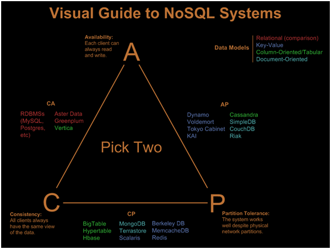

## CAP定理のはなし

桐野 俊輔([skirino](https://github.com/skirino))

***

## Brief History

- 1998: Eric Brewerが「予想」として発表
- 2002: [GilbertとLynchによる形式的な証明](http://webpages.cs.luc.edu/~pld/353/gilbert_lynch_brewer_proof.pdf)
- 2012: ["CAP Twelve Years Later" by Eric Brewer](http://www.cs.berkeley.edu/~rxin/db-papers/CAP.pdf)

***
***

## CAP theorem?

- 「分散システムのデータについて以下の"望ましい3つの性質"を同時に満たすことは不可能」
    - Consistency
    - Availability
    - Partition tolerance
- (2つを同時に満たすことは可能)
- 分散システムの設計におけるトレードオフになる

---

## "2 of 3" classification of DBs

(taken from https://www.rubyplus.com/articles/851 )

***
***

## Consistency

- 「いつも"最新"のデータを取得し、更新以前の古いデータが取得されることがないこと」
    - つまり、書き込みの後に読み込みを行うと、必ず書き込みが反映されている

---

## Availability

- 「生きているnodeが受け取ったリクエストが必ず結果を返すこと」
    - (死んでるnodeにリクエストして返事がなくても"available"でありうる)

---

## Partition tolerance

- 「**任意の**partitionが発生しているときにも"適切に"動作すること」
    - Network partition:
        - 5台が3-2に分かれるケース
        - 5台が4-1に分かれるケース(1台が故障した場合もほぼ同様の状況)
        - 5台が1×5に分かれるケース(すべての通信が途絶)
    - [証明](http://webpages.cs.luc.edu/~pld/353/gilbert_lynch_brewer_proof.pdf)における"network partition"の形式的定義:
        - _In order to model partition tolerance, the network will be allowed to lose arbitrarily many messages sent from one node to another._

***
***

## Intuitive explanation

- 2 nodesからなるシステムで分断が起きているとき
    - 片側でデータ更新してからもう片方から読み込み => "C"でない
    - "C"を保つためにはデータ更新を受け付けてはならない => "A"でない
    - "C"かつ"A"のためには通信が必要 => "P"でない

---

## Trivial "2 of 3" behaviors

- 3つのうち2つが同時に実現できることは明らか
    - 常にエラー => CP
    - 初期値を返し続ける => AP
    - single node => CA
        - (「CAでPでない」が何を意味するかは不明確だが、特に面白くない部分なので深く考える必要なし)

***
***

## CAP confusions (1)

- partition toleranceの意味合い
    - partitionは障害であり100%コントロールできない(他2つとは別物)。NW, HWなどの障害がありうる限り、partitionが発生する想定をすべき
    - その際にも"C"か"A"のどちらかはキープしたい
    - [現代的な解釈は _during a network partition, a distributed system must choose either Consistency or Availability._](https://foundationdb.com/key-value-store/white-papers/the-cap-theorem)

---

## CAP confusions (2)

- partitionにも程度がある
    - 例えば5台のうち1台が故障したような状況
        - このレベルのpartitionでは、妥当な実装であれば"C"と"A"を保てる(過半数nodeでconsensus)
        - このために"C"と"A"を犠牲にする必要はない

---

## CAP confusions (3)

- "2 of 3" view is misleading
    - 致命的レベルのpartitionはめったに起こらない。大部分の時間帯は"C"と"A"両方を保証するシステムが望ましい
    - 1つのシステム内で"C"と"A"の間のバランスを変更可能(tunable consistency)

***
***

### Case study: Mongo replica set (1)

- primaryが2つになる場合がある
    - nodes 3つのreplica set
    - => "primary"と"2 secondaries"にsplit
    - => secondary 2つから新しいprimaryが選ばれる
    - (元々のprimaryはそのうちsecondaryになる)

---

### Case study: Mongo replica set (2)

- primaryが2つの時間帯に
    - majorityへ書き込み => minorityから読み込み
        - stale read
    - minorityへ書き込み => majorityから読み込み
        - stale read
    - minorityへ書き込み:
        - [rollback](http://docs.mongodb.org/manual/core/replica-set-rollbacks/)によるloss
- ([write concern](http://docs.mongodb.org/manual/reference/write-concern/)次第で事情が微妙に変わりうる)
- [Mongoのdocumentにも書かれている](http://docs.mongodb.org/manual/core/replication-introduction/#edge-cases-2-primaries)

---

### Case study: Mongo replica set (3)

- Mongo公式ドキュメントで["strong consistency"と言っている](https://www.mongodb.com/nosql-explained)
    - 実際はcorner caseでの"C"の保証はない
- マズい部分: 以下の両方の修正がおそらく必要
    1. 書き込みの[isolation levelが"read uncommitted"](http://docs.mongodb.org/manual/reference/write-concern/#read-isolation-behavior): 書き込み途中で結果が読み取れてしまう点
        - これはpartitionがないときでも問題
    2. 読み取り時に他nodeの状況を見ていない点 (もしくはprimaryが2つになってしまう点)
- 参考: https://aphyr.com/posts/322-call-me-maybe-mongodb-stale-reads

***
***

## New generation of DBs (1)

- 目一杯"C"と"A"を追求していると思しきDB:
    - "C"寄り:
        - [FoundationDB](https://foundationdb.com/)
        - [OrientDB](http://orientdb.com/orientdb/)
        - [NuoDB](http://www.nuodb.com/)
        - [Google Spanner](http://static.googleusercontent.com/media/research.google.com/ja//archive/spanner-osdi2012.pdf), [CockroachDB](https://github.com/cockroachdb/cockroach)
    - 分散トランザクション、半数未満のnode故障への耐性

---

## New generation of DBs (2)

- 目一杯"C"と"A"を追求していると思しきDB:
    - "A"寄り:
        - [Amazon Dynamo](http://www.allthingsdistributed.com/files/amazon-dynamo-sosp2007.pdf)
        - [Cassandra](http://cassandra.apache.org/)
        - [Riak](http://basho.co.jp/riak/)
    - tunable consistency

***
***

## Summary

- CAP定理の意味するところとトレードオフ
    - Mongoで妙なことが起きる話
    - 一時のNoSQLの流行から少し経って、新手DBの設計のトレンド
- 分散システムを選定する際は要チェック
    - (自戒も込めて)"strongly consistent", "highly available"などの宣伝文句の意味を正確に理解しよう

---

## References

- [http://webpages.cs.luc.edu/~pld/353/gilbert_lynch_brewer_proof.pdf](http://webpages.cs.luc.edu/~pld/353/gilbert_lynch_brewer_proof.pdf)
- http://www.cs.berkeley.edu/~rxin/db-papers/CAP.pdf
- http://codahale.com/you-cant-sacrifice-partition-tolerance/
- http://blog.cloudera.com/blog/2010/04/cap-confusion-problems-with-partition-tolerance/
- https://foundationdb.com/key-value-store/white-papers/the-cap-theorem
- https://aphyr.com/posts/322-call-me-maybe-mongodb-stale-reads
