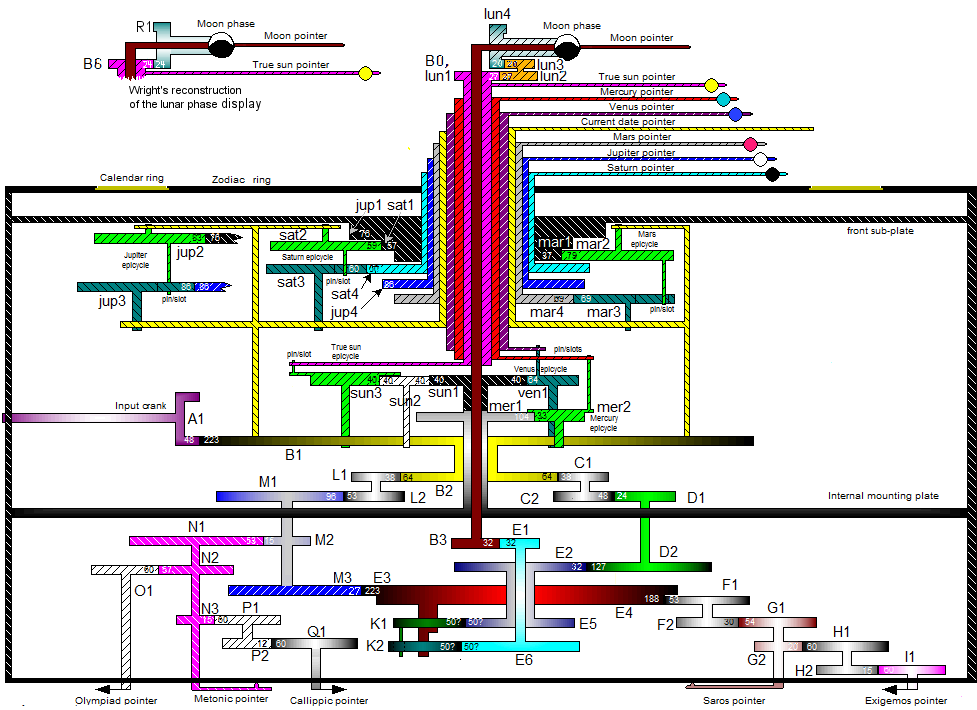
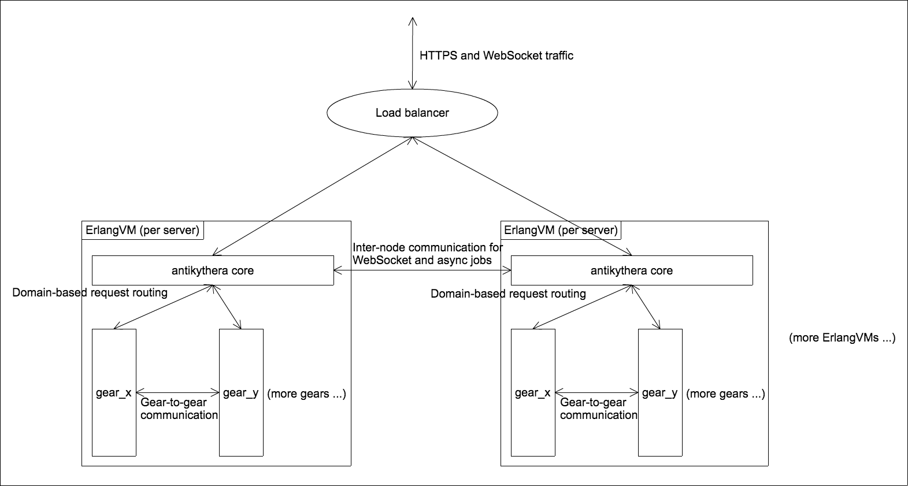
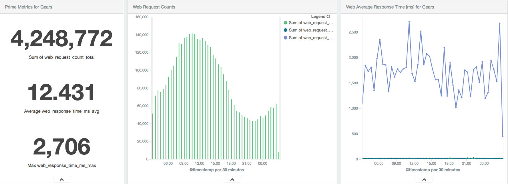

### Antikythera Framework

桐野 俊輔 ([skirino](https://github.com/skirino)) @ [ACCESS](http://jp.access-company.com/)

[Erlang & Elixir Fest 2018](https://elixir-fest.jp/) (2018/6/16)

***

### Agenda

1. What is Antikythera Framework?
    - brief history, our motivations
2. Core features and benefits
    - comparisons with other frameworks
3. Deep-dive into the internals
    - pros/cons of some design decisions

---

### About the speaker

- 桐野 俊輔 (Shunsuke Kirino)
- Ex-physicist
- Server-side guy in [ACCESS](http://jp.access-company.com/) since 2011
- Developing antikythera core and operating antikythera clusters since 2015

***
***

### 1. What is Antikythera Framework?

***
***

### About the name

- The Antikythera mechanism
    - An ancient Greek analog computer
    - Discovered in 1902 near the coast of [Antikythera island](https://en.wikipedia.org/wiki/Antikythera)
    - Kind of an "Out-Of-Place ARTifact"

---

### The Antikythera mechanism

---

### The Antikythera mechanism

- Used to predict astronomical positions and eclipses
    - for calendar and astrological purposes

---

### Gear scheme (hypothetical)

***
***

### So what's Antikythera Framework?

- In a nutshell,

  "Elixir Framework for in-house PaaS"
- (Apache 2-licensed)

***
***

### History: Our problems in 2015

- 10s of running web services
    1. developed using different languages
    1. operated in different ways
    1. involving significant infrastructure cost

---

### (1) Divergence in technology stacks

- Problems:
    - Little chance of code reuse
    - Increased cost for developer bootstrapping
- What we wanted:
    - One language for server-side development

---

### (2) Divergence in operations

- Problems:
    - Lack of sharing of scripts/knowledge across teams
    - Teams had no time to automate their "toil"s
- What we wanted:
    - Standardized & automated operations (deployment, etc.)

---

### (3) Infrastructure cost

- Problems:
    - Extra cost for "buffer" and "redundancy", too many idle CPUs
    - Many resources to monitor/manage
- What we wanted:
    - Single pool of computational resources that can be shared by all services

---

### Our approach

- An Elixir framework that hosts multiple web services in a single ErlangVM cluster

---

### Antikythera "gear"

- Hereafter we call each web service running within an antikythera cluster as a "gear"
    - Actually the name "antikythera" comes from this term
- Gear may depend on other gear(s)

***
***

### 2. Core features and benefits

***
***

### Basic idea

- Load all beam files in the same ErlangVM
- Control resources by Elixir code

---

### Architecture

***
***

### Core features (1)

- As a platform for multiple services
    - Resource control and isolation
        - gear doesn't disturb other gears
    - Automated operations
        - deploy with hot code upgrades, etc.
    - Built-in common functionalities
        - logging, metrics reporting, etc.

---

### Core features (2)

- As a web framework
    - Domain-based request routing
        - determine which gear to handle
    - Path-based request routing within a gear
        - determine which module/function to handle
    - Features similar to e.g. [phoenix](http://phoenixframework.org/)

---

### Core features (3)

- As an asynchronous job executor
    - Built-in distributed job queues
    - Running arbitrary Elixir code for each job
    - One-off and periodic (cron) job scheduling

***
***

### Benefits

- 1 language to learn
    - Straightforward code reuse
- Centralized cluster management
    - Gear devs are freed from server/dependency management
- Reduced infrastructure cost

---

### Cost savings

- Antikythera prod cluster in ACCESS
    - running in AWS
    - ~25 gears (would require ~50 instances)
    - only 3 c4.large instances
    - 2 guys to operate

---

### Additional benefits

- Developers can freely deploy their own gears to our dev cluster
    - start TLS-enabled web service in minutes
    - no operation on their side
    - good for experimentation/prototyping

***
***

### Comparisons with [phoenix](http://phoenixframework.org/)

- Both are Elixir-based frameworks
- Phoenix has matured with large user base
- Antikythera offers a novel execution model for multiple services

---

### Comparisons with micro-services (1)

- Both advocate service-level code separations
- Antikythera reduces servers to manage, standardizes operations
- Gear-to-gear communications in antikythera involves less overhead

---

### Comparisons with micro-services (2)

- Microservices enforce complete isolation; in antikythera it's less strict
- Antikythera uses computational resources more effectively
    - CPU/memory can be shared by all gears

***
***

### FAQ: What about DBs?

- Antikythera itself is DB-agnostic
- You can use any DB with any lib as you like
- Executor pools (explained later) provide basis for rate limiting accesses to DB

***
***

### Amenities for gears

- Gear comes with the followings out-of-the-box
    - gear config
    - alerting
    - logging
    - metrics reporting

---

### Gear config

- Arbitrary map for each gear
    - Store secrets and dynamic configurations
        - such as API keys, connection strings, ...
- Original data is stored in an encrypted JSON file
- The data is cached in ETS for fast access

---

### Logging

- Each gear has its own logger process
- The following logs are auto-generated
    - HTTP: request & response
    - websocket: connect & disconnect
    - async job: start & end
    - error logs with stacktrace

---

### Alerting

- When an exception is raised (not caught) by gear code, antikythera sends an email to the gear developers (in addition to error logs)
    - Consecutive error alerts are batched
- Necessary to quickly find and fix bugs

---

### Metrics reporting

- Various metrics are auto-gathered and sent to `MetricsStorage`
    - HTTP response times (average, 95%, max)
    - async job execution times (average, 95%, max)
    - status of exec pool: running/total processes
    - ErlangVM-level metrics

---

### Metrics reporting

- Example: store metrics in elasticsearch and watch them via kibana dashboard:

***
***

### 3. Deep-dive into the internals

***
***

### Architecture

---

### HTTP request handling

- HTTP 1.1 server using [cowboy 2](https://github.com/ninenines/cowboy)
- Domain-based routing using cowboy's router
- Path-based routing by matching against macro-generated function clauses

---

### Gear-to-gear communications

- Service-level interactions (HTTP-like)
    - synchronous, headers and bodies, etc.
    - enables code sharing in HTTP- and g2g-handlers
- Elixir-level interactions
    - Direct function calls

---

### Clustering

- To maintain the cluster, each node periodically
    - polls the current list of nodes from e.g. infrastructure API
    - connects to any unconnected nodes
- Cluster-wide process registry using [syn](https://github.com/ostinelli/syn)

***
***

### EAL

- (Short for Environment Abstraction Layer)
- Pluggable infra-dependent features using behaviours
- Concrete implementations are specified by compile-time mix configurations
    - see [`AntikytheraEal.ImplChooser`](https://github.com/access-company/antikythera/blob/master/eal/util/impl_chooser.ex)

---

### EAL

- Behaviours:
    - [`ClusterConfiguration`](https://hexdocs.pm/antikythera/AntikytheraEal.ClusterConfiguration.Behaviour.html)
    - [`AlertMailer`](https://hexdocs.pm/antikythera/AntikytheraEal.AlertMailer.Behaviour.html)
    - [`LogStorage`](https://hexdocs.pm/antikythera/AntikytheraEal.LogStorage.Behaviour.html)
    - [`MetricsStorage`](https://hexdocs.pm/antikythera/AntikytheraEal.MetricsStorage.Behaviour.html)
    - [`AssetStorage`](https://hexdocs.pm/antikythera/AntikytheraEal.AssetStorage.Behaviour.html)
- For AWS [`antikythera_aws`](https://github.com/access-company/antikythera_aws) is available

***
***

### Resource control

- Erlang process:
    - its own execution context and memory space, isolated from other processes
- Thus, "number of processes" can be used as 1st approximation of resource consumption
- (That's why we chose Elixir)

---

### Executor pool

- Control resources in terms of processes
- Consists of 3 pools per type of tasks
    - web request handlers
    - websocket connections
    - async job runners

---

### Multi-tenant use cases

- Executor pool also supports multi-tenant gears
    - Making exec pool per tenant
    - Assigning exec pool when processing a task (e.g. an HTTP request)

---

### Other limits

- There are also upper limits on
    - size of heap memory per process
    - request/job execution times
    - rate of accesses to async job queues

---

### Isolation

- As gears run in the same ErlangVM, they are not completely isolated
    - Gear can e.g. call other gear's code, get other gear's secrets, etc.
- That's why it's for "in-house PaaS"
    - Untrusted code shouldn't be installed in antikythera clusters

***
***

### Dependency management

- All gears run in the same ErlangVM
    - They share the same libraries and configurations
- To unify management of deps/configs, one needs an "antikythera instance"

---

### Antikythera instance

- A mix project to manage deps/configs for a specific antikythera cluster
    - directly depends on antikythera
- All gears in the cluster depend on the antikythera instance
    - by doing so gears share the same deps/configs

---

### Deployment model

- Antikythera instance is packaged and deployed as an OTP release
- Each gear is packaged and deployed as an OTP application
    - Gears are not included in the OTP release
- Antikythera polls new versions of instance/gears and self-updates them

***
***

### Async job queues

- Job queue per exec pool
    - distributed, fault tolerant data structure implemented using [`raft_fleet`](https://github.com/skirino/raft_fleet)
    - runs within the same cluster of ErlangVMs
- Using DB for queues is also possible
    - but we want to avoid excessive polling; we want push-based interactions

---

### Async job workers

- Reside in the same ErlangVM
    - don't separate nodes by role, make all nodes homogeneous
        - simplest possible cluster management

***
***

### Elixir macro

- Used for e.g.
    - filling out mix settings and configs
    - generating common code for gears
    - routing DSL
- Plays a vital role in antikythera

---

### Static analysis

- Introduced as a [mix compiler](https://hexdocs.pm/antikythera/Mix.Tasks.Compile.GearStaticAnalysis.html)
    - check conformance to some of the [gear coding rules](https://hexdocs.pm/antikythera/must_nots.html)
        - module naming, prohibited functions, etc.
    - problematic code in gear results in a compile error

***
***

### Summary

- Antikythera Framework provides higher level abstractions for your web services
    - Try it yourself!
- Let's unleash the full potential of Erlang and Elixir!
