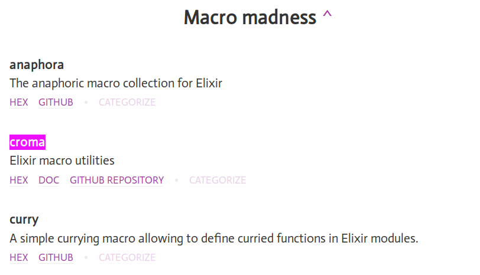

## Introduction to [croma](https://github.com/skirino/croma)

桐野 俊輔 ([skirino](https://github.com/skirino)) @ [ACCESS](http://jp.access-company.com/)

tokyo.ex #1
2016/4/19

***

[](http://toolbox.elixir.pm/#p-31)

***
***

### What?

- Elixir macro utilities
    - For extensive use of types
    - With less typing
- (This slides are based on croma v0.4.1)

---

### Motivation

- Even in Elixir types are good
    - to clearly express intention
- But
    - writing `@spec` is sometimes tedious
    - no type-checking is in place
- Let's fix that using macros

***
***

### `def` with `@spec`

```elixir
@spec foo(integer, atom) :: String.t
def foo(i, a) do
  "#{i} #{a}"
end
```

- `foo` appears twice; duplicated

---

### Let's make it DRY: `defun`

```elixir
use Croma
defun foo(i :: integer, a :: atom) :: String.t do
  "#{i} #{a}"
end
```

- Compiler expands this to the previous example
- Each argument and its type is placed side by side

***
***

### `def` with guard

```elixir
@spec foo(integer, atom) :: String.t
def foo(i, a) when is_integer(i) and is_atom(a) do
  "#{i} #{a}"
end
```

- `i`, `a` in both parameter list and guard
- Specifying argument types twice:
    - `integer` and `is_integer/1`
    - `atom` and `is_atom/1`

---

### Make it DRY again

```elixir
use Croma
defun foo(i :: g[integer], a :: g[atom]) :: String.t do
  "#{i} #{a}"
end
```

- Expanded to the previous example
    - No duplicated `foo`, `i`, `a`
    - Guards generated from `g[type]`

***
***

### Satisfied?

- Not at all
- Guards are fairly limited
    - Only handful of functions are allowed in guards by VM
- What we want:
    - More fine-grained data types
        - e.g. `String.t` => `UserName.t`
    - Checking values with arbitrary conditions
        - e.g. regex matching

***
***

### Building block: "Type module"

- Compared with Erlang, modules in Elixir are much lighter weight
    - So let's make many small modules
- We call modules that define the following as "type modules".
    - `@type t`
    -  `validate/1`

---

### Example (1)

```elixir
defmodule UserName do
  @type t :: String.t

  defun validate(value :: any) :: {:ok, t} | {:error, any} do
    if is_binary(value) and value =~ ~r/^\w+$/ do
      {:ok, value}
    else
      {:error, :invalid}
    end
  end
end
```

---

### Example (1')

- Typical type modules can be easily defined with helpers provided by croma:

```elixir
defmodule UserName do
  use Croma.SubtypeOfString, pattern: ~r/^\w+$/
end
```

---

### Example (2)

```elixir
defmodule User do
  use Croma.Struct, fields: [
    user_name: UserName,
    password:  Password,
  ]
end
```

- Using `UserName` and `Password`, it's converted to
    - `defstruct`
    - `@type t :: %__MODULE__{...}`
    - `validate/1`
    - (and more)

---

### Example (2')

```elixir
defmodule User do
  import Croma.TypeGen # for `nilable`

  use Croma.Struct, fields: [
    user_name:   UserName,
    password:    Password,
    description: Croma.String,                 # built-in type as type module
    age:         nilable(Croma.NonNegInteger), # ad-hoc generation of type module
  ]
end
```

- Useful for e.g. validating JSON data

***
***

### `defun` with type modules

```elixir
defun register(user_name :: v[UserName.t], password :: v[Password.t]) :: User.t do
  do_register(user_name, password)
end
```

- [Design by contract](https://en.wikipedia.org/wiki/Design_by_contract)
    - inside function body `user` is guaranteed to be valid

---

### Expansion of `v[Mod.t]`

```elixir
@spec register_user(UserName.t, Password.t) :: User.t
def register_user(user_name, password) do
  user_name =
    case UserName.validate(user_name) do
      {:ok, value}     -> value
      {:error, reason} -> raise "validation error for user_name: #{inspect(reason)}"
    end
  password =
    case Password.validate(password) do
      {:ok, value}     -> value
      {:error, reason} -> raise "validation error for password: #{inspect(reason)}"
    end
  do_register(user_name, password)
end
```

---

### Doesn't it make things slow?

- Yes but don't worry
    - You can disable arguments validation in production
    - Code generation is done by Elixir code and thus controllable

***
***

### Summary

- `croma` reduces boilerplate code and makes type-oriented programming more pleasant

- Feedbacks/comments/suggestions/bug reports/PRs are more than welcome

- Happy `defun`-ing!

- (BTW, my boss said that we are hiring!)

***
***

### Other components in croma

***
***

### `Croma.Result`

- Utilities to handle results of computations that can either succeed or fail.
- (In the following I assume `alias Croma.Result, as: R`)

---

### Errors in Elixir functions

1. return error-tuple
    - requires pattern-matching on results, most flexible
2. `raise/1`
    - typically caller won't rescue and then crash
3. crash (`exit/1`)
    - situations that should be handled with restart (by supervisor)
4. (please forget about `throw/1`)

---

### `R.t`

- `R.t/1` is the type to express results of computations.
- A value of `R.t/1` is either ok-tuple or error-tuple.

```ex
@type t(a) :: {:ok, a} | {:error, any}
```

- 2nd element of ok-tuple is the resulting value of the successful computation.
- 2nd element of error-tuple is the reason of the failure.

---

### Utils defined in `R`

- You can simply pattern match values of `R.t(a)`.
- However for common operations croma defines utility functions for you.

---

### `R.get/2`, `R.get!/1`

- To extract successful value of a result use `R.get/1`, `R.get/2`, `R.get!/1`

```ex
R.get({:ok, 1})       # => 1
R.get({:error, :foo}) # => nil

R.get({:ok, 1}      , 0) # => 1
R.get({:error, :foo}, 0) # => 0

R.get!({:ok, 1})       # => 1
R.get!({:error, :foo}) # => raise
```

---

### `R.map/2`

- To combine
    1. computation that may fail, and
    2. computation that never fails,
- use `R.map/2`:

```ex
R.map({:ok, 1}      , fn i -> i + 1 end) # => {:ok, 2}
R.map({:error, :foo}, fn i -> i + 1 end) # => {:error, :foo}
```

---

### `R.map_error/2`

- To tweak error reason use `R.map_error/2`

```ex
R.map_error({:ok, 1}      , &Atom.to_string/1) # => {:ok, 1}
R.map_error({:error, :foo}, &Atom.to_string/1) # => {:error, "foo"}
```

---

### `R.ok?/1`, `R.error?/1`

- If all you want is just whether succeeded or failed, use `R.ok?/1` or `R.error?/1`

```ex
R.ok?({:ok, 1})       # => true
R.ok?({:error, :foo}) # => false

R.error?({:ok, 1})       # => false
R.error?({:error, :foo}) # => true
```

---

### `R.or_else/2` (macro)

- If you have "plan B" for when a computation failed, use `R.or_else/2` macro

```ex
R.or_else({:ok, 1}      , {:ok, 2}      ) # => {:ok, 1}
R.or_else({:error, :foo}, {:ok, 2}      ) # => {:ok, 2}
R.or_else({:ok, 1}      , {:error, :bar}) # => {:ok, 1}
R.or_else({:error, :foo}, {:error, :bar}) # => {:error, :bar}
```

---

### `R.bind/2`

- To combine 2 computations that may fail, use `R.bind/2`

```ex
f = fn(i) ->
  if rem(i, 2) == 0, {:ok, i}, else: {:error, :not_even}
end
R.bind({:ok, 2}      , f) # => {:ok, 2}
R.bind({:ok, 3}      , f) # => {:error, :not_even}
R.bind({:error, :foo}, f) # => {:error, :foo}
```

---

### `R.m/1` (macro)

- To sequentially run many computations that may fail, use `R.m/1` macro

```ex
R.m do
  x <- {:ok, 1}
  y <- {:ok, 2}
  z <- {:ok, 3}
  pure x + y + z
end
# => {:ok, 6}
```

---

### `R.try/1`

- To convert exception to error tuple use `R.try/1`

```ex
R.try(fn -> 1           end) # => {:ok, 1}
R.try(fn -> raise "foo" end) # => {:error, {%RuntimeError{message: "foo"}, [:try]}}
```

---

### `R.sequence/1`

- To convert multiple results into a single result use `R.sequence/1`

```ex
R.sequence([{:ok, 1}, {:ok, 2}      ]) # => {:ok, [1, 2]}
R.sequence([{:ok, 1}, {:error, :foo}]) # => {:error, :foo}
```
