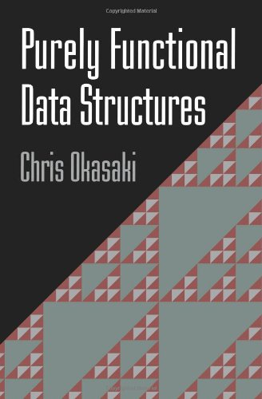
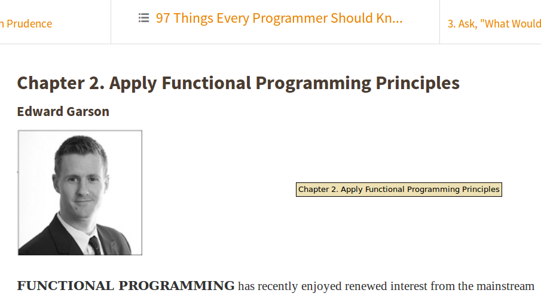

## Purely Functional Data Structures

桐野 俊輔([skirino](https://github.com/skirino))

***

[](http://www.amazon.co.jp/Purely-Functional-Structures-Chris-Okasaki/dp/0521663504)

Written by [Chris Okasaki](http://www.usma.edu/eecs/SitePages/Chris%20Okasaki.aspx)

---

## Every programmer should ...

[](https://www.safaribooksonline.com/library/view/97-things-every/9780596809515/ch02.html)

---

## Real World Haskellより

- 「12.9.3 読書案内」
    - _... Okasakiの本を関数プログラマにとっての必読書として推奨します。..._

---

## [モーダスポネンス](http://ja.wikipedia.org/wiki/%E3%83%A2%E3%83%BC%E3%83%80%E3%82%B9%E3%83%9D%E3%83%8D%E3%83%B3%E3%82%B9)により

- 全プログラマの必読書。

***
***

## "Functional" data structures (1)

- 純粋関数型: 「[参照透過性](http://ja.wikipedia.org/wiki/%E5%8F%82%E7%85%A7%E9%80%8F%E9%81%8E%E6%80%A7)があるコード」とだいたい同義
    - データ構造に関しては、データが書き換わると参照透過でない
    - つまり、immutableなデータ構造の話(persistentとも言う)

---

## "Functional" data structures (2)

- メリット
    - "いつの間にか変わってた"系のバグの心配が無い
    - "前のバージョン"が有効であり続ける
    - 並行処理で使いやすい
- デメリット
    - 大きなデータ構造の一部だけを更新する際に、全体のコピーを伴う場合がある

---

## "Functional" data structures (3)

- immutableなデータ構造における更新
    - 旧バージョンのデータ構造から一部を入れ替えた新バージョンを別オブジェクトとして作成
    - 効率のために新旧バージョンでデータを共有
        - ListやTreeがわかりやすくうまく行く例
- この本のテクニックを駆使すれば、persistentかつ効率の良いステキなデータ構造を設計できる(らしい)

***
***

## 例: FIFOキュー

- Queueのインターフェース

```scala
trait Queue[+T]
{
  def isEmpty: Boolean
  def enqueue[U >: T](u: U): Queue[U]
  def dequeue: (T, Queue[T])
}
```

- 以後のコードでは以下がある前提

```scala
type L[T] = List[T]
type S[T] = Stream[T]
```

***
***

## 2リストキュー (1)

```scala
class BatchedQueue[+T](f: L[T], r: L[T]) extends Queue[T] {
  def isEmpty: Boolean = f.isEmpty
  def enqueue[U >: T](u: U): BatchedQueue[U] = check(f, u :: r)
  def dequeue: (T, BatchedQueue[T]) = f match {
    case Nil    => throw new RuntimeException("Empty!")
    case h :: t => (h, check(t, r))
  }
  private def check[T](newf: L[T], newr: L[T]): BatchedQueue[T] = {
    if(newf.isEmpty)
      new BatchedQueue(newr.reverse, Nil)
    else
      new BatchedQueue(newf, newr)
  }
}
```

---

## 2リストキュー (2)

- 先頭が速くて末尾は遅いListを2つ組み合わせる
    - rear先頭に追加
    - front先頭から取り出し
    - front側のリストが空になったときにrear側をreverseして補充
- 計算量
    - 最悪実行時間: `reverse`が実行されるときに`O(N)`
    - 償却実行時間: `O(1)`っぽいが...?

---

## 2リストキュー (3)

- `reverse`が起きる直前のキューを何度もdequeueするときは...
    - 毎回同じように`reverse`して`O(N)`
    - その際コストを償却する他の操作を伴わない

***
***

## メモ化(+遅延評価)

- 何度も同じListを`reverse`してるのだから、メモ化で初回の結果を使い回せばOK
- 「困ったら間接層を導入」とも言う

```scala
class Lazy[+A](thunk: => A) {
  private lazy val value: A = thunk
  def force: A = value
}
```

---

## 銀行家キュー (1)

```scala
class BankersQueue[+T](lenf: Int, f: Lazy[S[T]], lenr: Int, r: S[T]) extends Queue[T]
{
  def isEmpty: Boolean = lenf == 0
  def enqueue[U >: T](u: U): BankersQueue[U] = check(lenf, f, lenr + 1, S.Cons(u, r))
  def dequeue: (T, BankersQueue[T]) = f.force match {
    case S.Empty       => throw new RuntimeException("Empty!")
    case S.Cons(h, f2) => (h, check(lenf - 1, f2, lenr, r))
  }
  private def check[T](lenf: Int, f: Lazy[S[T]], lenr: Int, r: S[T]): BankersQueue[T] = {
    if(lenf < lenr)
      new BankersQueue(lenf + lenr, Lazy(f.force ++ r.reverse), 0, S.Empty)
    else
      new BankersQueue(lenf, f, lenr, r)
  }
}
```

---

## 銀行家キュー (2)

- 「rear側を`reverse`してfront側に連結する操作」を`Lazy`に包んでメモ化
    - 何度も`reverse`を実行することはなくなった
    - 償却計算量: `O(1)`
- (計算量の解析で使っている"banker's method"が名前の由来)

***
***

## 実時間キュー (1)

- 最悪計算量をなんとかしたい
- worst caseのときの`reverse`処理を各ステップでちまちま実行するようにすれば、`O(1)`にできるはず

---

## 実時間キュー (2)

```scala
class RealtimeQueue[+T](f: S[T], r: L[T], s: S[T]) extends Queue[T]
{
  def isEmpty: Boolean = f.isEmpty
  def enqueue[U >: T](u: U): RealtimeQueue[U] = check(f, u :: r, s)
  def dequeue: (T, RealtimeQueue[T]) = f match {
    case S.Empty       => throw new RuntimeException("Empty!")
    case S.Cons(h, f2) => (h, check(f2.force, r, s))
  }
...
```

---

## 実時間キュー (3)

```scala
...
  private def check[T](f: S[T], r: L[T], s0: S[T]): RealtimeQueue[T] = s0 match {
    case S.Cons(x, s) => new RealtimeQueue(f, r, s.force)
    case S.Empty      =>
      val f2 = rotate(f, r, S.Empty)
      new RealtimeQueue(f2, Nil, f2)
  }
  private def rotate[T](xs0: S[T], ys0: L[T], a: S[T]): S[T] = ys0 match {
    case Nil     => throw new Exception("Logic error!")
    case y :: ys => xs0 match {
      case S.Empty       => S.Cons(y, a)
      case S.Cons(x, xs) => S.Cons(x, Lazy(rotate(xs.force, ys, S.Cons(y, a))))
    }
  }
}
```

---

## 実時間キュー (4)

- `s: Stream[T]`はfront側Streamの少し先を保持
- `check`で地味に`s: Stream[T]`の評価を一段階`force`して進める
- 進めるものがない場合、rear側をreverseするthunkを作って補充
- すべての操作が`O(1)`に収まっている
    - `rotate`で再帰に見えるが`Lazy`を作るだけ

***
***

## 最後に

- (言語を問わず)できるかぎりimmutableなデータ構造を使おう
    - 破壊的更新が要るとわかってからmutable版に乗り換え
- immutableデータ構造の実装で何を行っているかイメージしよう
    - 主要な操作のオーダーを把握しておく

---

## References

- http://www.amazon.co.jp/Purely-Functional-Structures-Chris-Okasaki/dp/0521663504
- http://www.kmonos.net/pub/Presen/PFDS.pdf
