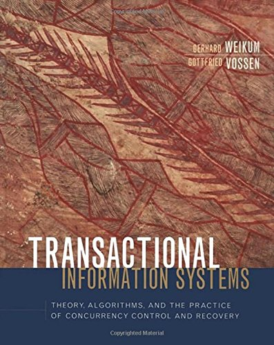

## Transactional Information Systems

桐野 俊輔([skirino](https://github.com/skirino))

***

## 長く険しい戦いであった

---

## 読もうと思ったモチベーション

- DBはビジネス上の重要性に対して理解してなさすぎ
    - 意識しなくてもそれなりに仕事になるのはスバラシイという言い方もできる
    - が、"それなり"止まり
- 中でもトランザクション関係は(個人的に)謎に包まれている

---

## おことわり

- わかってないところも(当然、いっぱい)ある。ツッコミ歓迎
- このスライドをself-containedにするつもりはほぼなくて、話の材料のリンク集程度
- [一人トランザクション技術 by @kumagiさん](http://qiita.com/advent-calendar/2016/transaction)が驚異的にまとまってる。そっち見たほうがいい

***
***

## [トランザクションとは](http://qiita.com/kumagi/items/5262ff4551ba19943b70)

- データに対する1つ以上の処理をまとめたもの
- トランザクションが"いい感じに"実行されてほしい
    - 他の処理と"かち合わない"、操作が失われない、... => ACID

---

## [ACID](http://qiita.com/kumagi/items/e93a57535db04e66368f) : Atomic

- トランザクション実行の**結果**がall or nothingになること
    - 一部のデータだけ更新されたりしない

---

## [ACID](http://qiita.com/kumagi/items/e93a57535db04e66368f) : Consistent

- 予め定められたconstraintsを逸脱するトランザクションはコミットされない
    - NOT NULL等。製品によって課せる制約にかなりバラつきがある
    - CAP定理のCとは別物

---

## [ACID](http://qiita.com/kumagi/items/e93a57535db04e66368f) : Isolated

- トランザクション実行の**過程**が他に影響を与えない
    - 書き込みがコミットされる前に読めてはマズい、等
- 実際は[isolation level](http://qiita.com/kumagi/items/1dc1a91ec007365ac694)に応じて調整可能
    - ある程度緩いレベルで良しとしている場合が多い

---

## [ACID](http://qiita.com/kumagi/items/e93a57535db04e66368f) : Durable

- Durable: 成功したトランザクションの結果が失われない
    - 不揮発性のディスクにデータがflushされてから"成功"にする
        - (正確にはメディアリカバリの話もあるが、ここでは無視)

---

## ちなみに、意味ないけど

- パフォーマンスを気にしなければ簡単。たとえば
    - 1度に1クエリしか受け付けず
    - すべての書き込みをログに書いて
    - すべての読み込みでログをフルスキャン
- 「好ましい性質を保ちつつパフォーマンスを改善する」ための努力が重ねられている

***
***

## 本の構成・話の流れ

1. concurrency control
    - recovery不要の状況でのconcurrencyを議論
        1. 読み書き処理のinterleavingの仕方の分類
        2. 望ましいinterleavingを生み出すscheduling algorithmを考える
2. recovery
    - abortを含む場合のconcurrency control
    - crash後の復旧のためのlogging, checkpointing
3. distributed transaction
    - distributed concurrency control, recovery
    - 2-phase commitでがんばれ

***
***

## Page model

- ファイルI/O操作の単位としてのblockがベース
    - より高レベルの操作も結局blockの出し入れに帰着する
- 実際、各DB製品ごとに内部で"page"という固定長区画の連なりとしてデータを配置して管理していることが多い
    - この単位だと思ってもいい
- とは言っても、"連続領域"や"固定長"という要素を使わないので、key-value的に捉えておいてOK

---

## 操作のnotation

- $r_i(x)$ : $i$で識別されるトランザクションが$x$で識別されるページをread
- $w_i(x)$ : $i$で識別されるトランザクションが$x$で識別されるページをwrite
- $c_i$    : $i$で識別されるトランザクションがcommit
- $a_i$    : $i$で識別されるトランザクションがabort

---

## トランザクションのnotation

- readとwriteの列
    - 並列実行が許される部分の順序付けは不要なので半順序

---

## Historyとschedule

- history:
    - トランザクション$t_1, ..., t_n$の操作をinterleaveした結果で、
    - 各トランザクション操作の後ろにcommitかabortどちらか1つを含むもの
    - e.g. $r_1(x) r_2(x) r_1(y) w_1(x) w_2(y) c_1 c_2$
- schedule:
    - historyのprefix
    - e.g. $r_1(x) r_2(x) r_1(y)$

---

## Serial history

- トランザクションが何らかの順で逐次実行された形
    - e.g. $r_1(x) r_1(y) w_1(x) c_1 r_2(x) w_2(y) c_2$
- serial historyと"等価" <=> serializable

---

## Herbrand semantics

- $r_i(x)$は最後に$x$に書かれた値を読む
- $w_i(x)$は、$t_i$がそれまでに読んだすべての値を引数に取る関数の適用結果を書き込む

***
***

## Anomalies

- historyを分類して、OK/NGを判定したい
    - つまり"等価"とはどういうことか検討したい
- それにあたりどういうhistoryがNGかを考えておく

---

## [Dirty read](http://qiita.com/kumagi/items/5ef5e404546736ebac49#dirty-read-anomaly)

- commitされていない値をread
- $r_1(x) w_1(x) r_2(x) a_1 w_2(x) c_2$
- abortされない場合でも、計算途中の値を読むのもアウト

---

## [Read skew](http://qiita.com/kumagi/items/5ef5e404546736ebac49#read-skew-anomaly)

- read操作の間に変更commitが入ってしまった
- $r_1(x) w_2(x) w_2(y) c_2 r_1(y) c_1$

---

## [Lost update](http://qiita.com/kumagi/items/5ef5e404546736ebac49#lost-update)

- 2つの更新のうち1つしか適用されない
- $r_1(x) r_2(x) w_1(x) c_1 w_2(x) c_2$

---

## [Inconsistent read](http://qiita.com/kumagi/items/5ef5e404546736ebac49#inconsistent-read-anomaly)

- 同じ値を2回読んだら、間の変更commitによって書き換わってしまった
- $r_1(x) w_2(x) c_2 r_1(x) c_1$

---

## [Write skew](http://qiita.com/kumagi/items/5ef5e404546736ebac49#write-skew-anomaly)

- $r_1(x) r_2(y) w_1(y) w_2(x) c_1 c_2$
- たとえば以下だとすると、$x = y = 0$が$x = y = 1$になってしまう。serialに実行したら$(1, 2), (2, 1)$のどちらかになるはず
    - $t_1$ : $y = x + 1$
    - $t_2$ : $x = y + 1$

---

## [Read only anomaly](http://qiita.com/kumagi/items/5ef5e404546736ebac49#read-only-anomaly)

- $r_3(x) r_3(y) r_2(x) w_2(x) c_2 r_1(x) r_2(y) c_1 w_3(y) c_3$
    - $t_2, t_3$による書き込みの間にreadonlyな$t_1$が挟まる
    - $t_3$による$y$への書き込みは初期状態の$x$, $y$を使っているので、$t_3$ => $t_2$の順と等価
    - が、実際のcommit順は$c_2$ => $c_3$
    - このときに$t_1$が読む値はcommit順のとおり$t_2$で$x$が変更された値で、一意なserial historyと等価にならない

---

## (おまけ)[Clock skewによる因果関係のねじれ](https://www.cockroachlabs.com/blog/living-without-atomic-clocks/)

- page $x$はnode Aに、page $y$はnode Bにいるとする
- node Bのclockは正確、node Aのclockは100ms進んでいる
- $t=0$にトランザクション1が$x$に書いてcommit。node Aは$t=100ms$だと思っている
- $t=50ms$にトランザクション2が$y$に書いてcommit。node Bは$t=50ms$だと思っている(正しい)
- $x$, $y$の更新timestampがズレる

***
***

## [Final state serializable](http://qiita.com/kumagi/items/695f1641407fd726d180)

- 2つのscheduleの結果のHerbrand semanticsが同一であればfinal state equivalent
- 何らかのserial historyとfinal state equivalentなhistoryは$\in FSR$
- read skew等のanomalyを防げない、FSRに含まれるかの判定に時間がかかる => 実用的でない

---

## [View serializable](http://qiita.com/kumagi/items/ec498950f8d0a96012f5)

- 最後だけではなくすべてのread, writeでHerbrand semanticsが一致であればview equivalent
- 何らかのserial historyとview equivalentなhistoryは$\in VSR$
- $VSR \subset FSR$
- VSRに含まれるかの判定に時間がかかる => 実用的でない

---

## [Conflict serializable](http://qiita.com/kumagi/items/2cc25050d7eedb7d5c8d) (1)

- 同じpageに対する{r, w}, {w, r}, {w, w} : conflict
    - これらのペアの順序を入れ替えるとsemanticsが変わる
- それ以外のペアは入れ替えても等価(conflict equivalent)とみなせる

---

## [Conflict serializable](http://qiita.com/kumagi/items/2cc25050d7eedb7d5c8d) (2)

- 何らかのserial historyとconflict equivalentなhistoryは$\in CSR$
- e.g.
    - $w_1(x) r_2(x) w_1(y) w_1(z) r_3(z) w_2(y) w_3(y) w_3(z)$
    - $\Rightarrow w_1(x) w_1(y) r_2(x) w_1(z) w_2(y) r_3(z) w_3(y) w_3(z)$
    - $\Rightarrow w_1(x) w_1(y) w_1(z) r_2(x) w_2(y) r_3(z) w_3(y) w_3(z)$
    - $\equiv t_1 t_2 t_3$
- $CSR \subset VSR$

---

## [Conflict serializable](http://qiita.com/kumagi/items/2cc25050d7eedb7d5c8d) (3)

- "serializability theorem"
- CSRに属するかは有向グラフで表現できる
- scheduleから"conflict graph"を以下のように描く
    - 関与するトランザクションがvertex
    - conflictにある操作のペアがedge
- e.g.
    - $r_1(x) r_2(x) w_1(x) r_3(x) w_3(x) w_2(y) c_3 c_2 w_1(y) c_1$
    - $t_1$ => $t_3$, $t_2$ => $t_1$, $t_2$ => $t_3$

---

## [Conflict serializable](http://qiita.com/kumagi/items/2cc25050d7eedb7d5c8d) (3)

- $s \in CSR$ iff conflict graph is asyclic
    - conflictしている部分は入れ替えられないので、その順序でconflict equivalentなserial historyが決まる

***
***

- Concurrency control algorithmsに続く...
